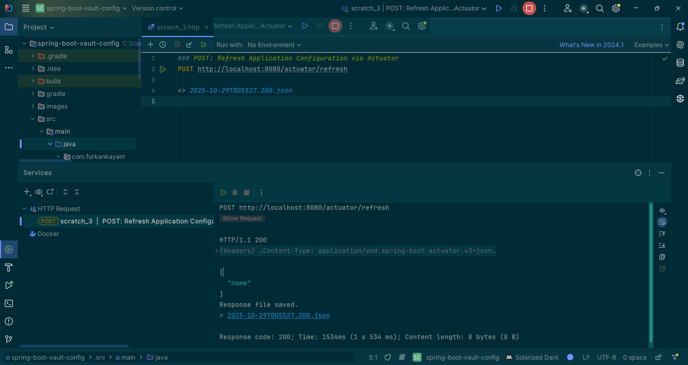

# 🚀 Spring Boot Vault Config

✅ **This project demonstrates HashiCorp Vault integration for securely managing sensitive information (credentials, API keys, database passwords, etc.) in Spring Boot applications**

## 🛠️ Technologies

[](https://www.java.com/en/)
[](https://spring.io/)
[](https://www.vaultproject.io/)
[](https://gradle.org/)
[](https://docs.docker.com/)

## 📖 Documentation

[](./VAULT_SETUP.md)

## 🚀 How to Run

1. **Start Vault** (See Documentation section above)

2. **Run the Application**
```sh
./gradlew bootRun
```

The application will start on `http://localhost:8080`

## 🔌 API Endpoints

### Test Endpoint
```http
GET http://localhost:8080/hello
```

Returns the secret value from Vault.

### Refresh Configuration
```http
POST http://localhost:8080/actuator/refresh
```

Refreshes the application configuration from Vault without restarting the application.

**Example with cURL:**
```sh
curl -X POST http://localhost:8080/actuator/refresh
```

<details>
<summary>📸 Click to see the refresh response</summary>



The response shows which configuration properties were successfully reloaded from Vault.
</details>

## 🔄 Dynamic Configuration Update

This project uses `@RefreshScope` to enable dynamic configuration updates:

1. Update your secret value in Vault
2. Call the refresh endpoint: `POST http://localhost:8080/actuator/refresh`
3. The new value will be reflected immediately without restarting the application

**Example Flow:**
```sh
# 1. Check current value
curl http://localhost:8080/hello

# 2. Update value in Vault UI

# 3. Refresh configuration
curl -X POST http://localhost:8080/actuator/refresh

# 4. Check updated value
curl http://localhost:8080/hello
```

## 📄 License

This project is licensed under the MIT License. See the [LICENSE](LICENSE) file for details

**Created by** [Mehmet Furkan KAYA](https://www.linkedin.com/in/mehmet-furkan-kaya/)