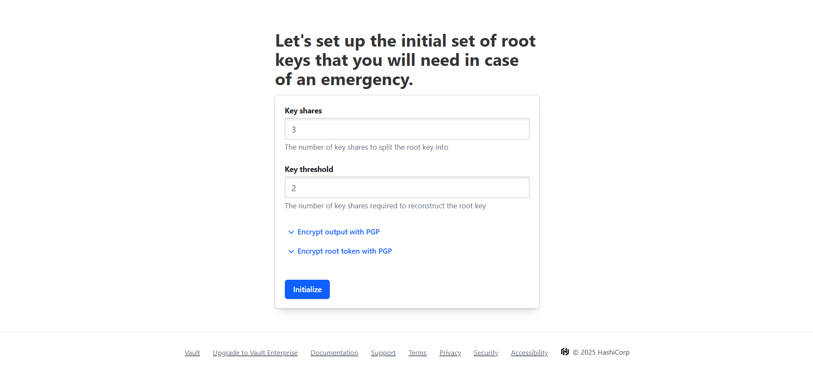
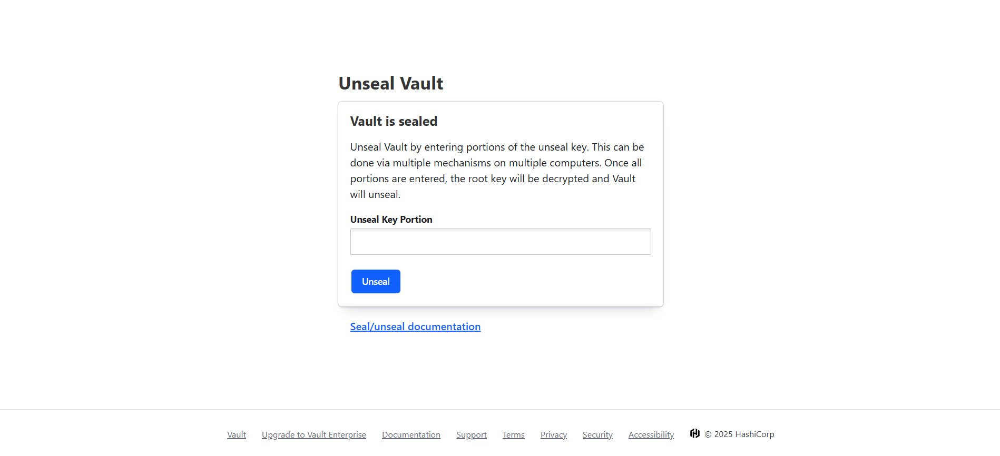
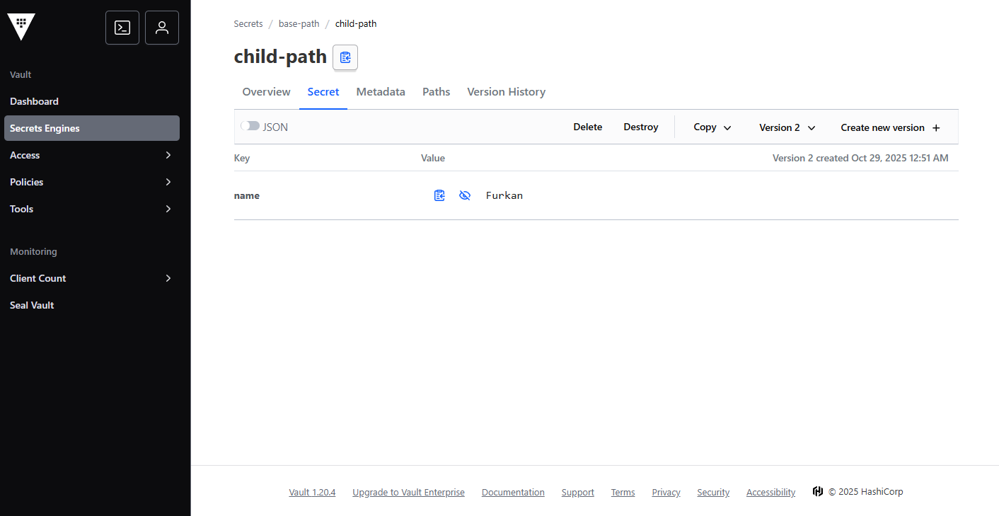
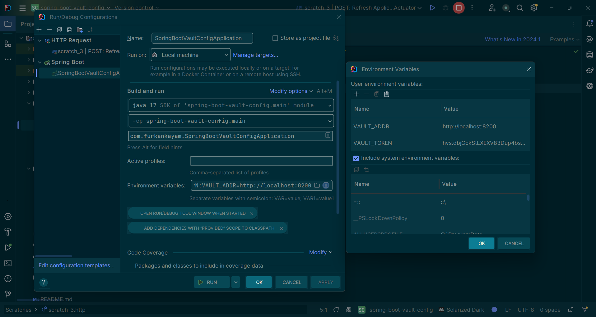

# Vault Setup Guide

## 1. Start Vault with Docker

```sh
docker-compose up -d
```

<br>

## 2. Initialize Vault

<div align="center">
  
</div>

Download the JSON file containing your unseal keys and root token.

**Example JSON output:**
```json
{
  "keys": [
    "---",
    "---",
    "---"
  ],
  "keys_base64": [
    "---",
    "---",
    "---"
  ],
  "root_token": "---"
}
```

> ⚠️ **Important:** Keep this file secure! These keys are required to unseal Vault and the root token provides full access.

<br>

## 3. Unseal Vault

<div align="center">
  
</div>

Use the unseal keys from the previous step to unseal your Vault instance.

<br>

## 4. Configure Secrets

<div align="center">
  
</div>

Create and manage your secrets in Vault.

<br>

## 5. Configure IntelliJ IDEA Environment Variables

<div align="center">
  
</div>

Configure the following environment variables in your IntelliJ IDEA run configuration:

| Variable | Value | Description |
|----------|-------|-------------|
| `VAULT_ADDR` | `http://localhost:8200` | The address of your Vault server |
| `VAULT_TOKEN` | `---` | Your root token from step 2 |

> 💡 **Tip:** These variables enable the Spring Boot application to authenticate and connect to Vault securely.
